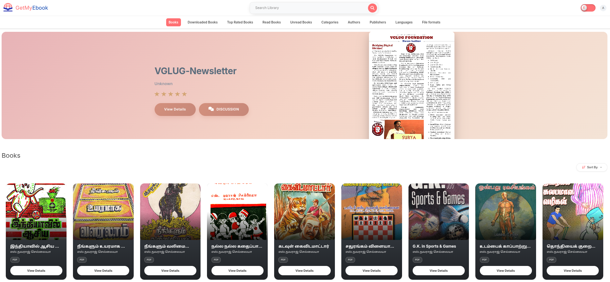

<div align="center">
    
</div>

GetMyEBook-Web is a powerful, feature-rich web application for browsing, reading, and managing your eBook collection. It is an advanced fork of [Calibre-Web](https://github.com/janeczku/calibre-web), enhanced with PostgreSQL support, a built-in discussion forum, and a modernized UI.

[](LICENSE)


<details>
<summary><strong>Table of Contents</strong> (click to expand)</summary>

1. [About](#GetMyEBook-Web)
2. [Features](#features)
3. [Prerequisites](#prerequisites)
4. [Installation](#installation)
5. [Quick Start](#quick-start)
6. [Getting Help](#getting-help)
</details>
<br>



## Features
- Modern and responsive Bootstrap 3 HTML5 interface
- Full graphical setup
- Comprehensive user management with fine-grained per-user permissions
- Admin interface
- Multilingual user interface supporting 20+ languages (supported languages)
- OPDS feed for eBook reader apps
- Advanced search and filtering options
- Custom book collection (shelves) creation
- eBook metadata editing and deletion support
- Metadata download from various sources (extensible via plugins)
- eBook conversion through Calibre binaries
- eBook download restriction to logged-in users
- Public user registration support
- Send eBooks to E-Readers with a single click
- Sync Kobo devices with your Calibre library
- In-browser eBook reading support for multiple formats
- Upload new books in various formats, including audio formats
- Calibre Custom Columns support
- Content hiding based on categories and Custom Column content per user
- Self-update capability
- "Magic Link" login for easy access on eReaders
- LDAP, Google/GitHub OAuth, and proxy authentication support
- PostgreSQL Support: Enterprise-grade database backend for better performance and scalability.
- Integrated Discussion Forum: A split-screen reading and discussion interface allowing users to discuss books while reading.
- Modern UI/UX: Enhanced design with responsive layouts and premium aesthetics.
- Automated Setup: One-step configuration wizard.
- Book Reader: In-browser reading support for EPUB, PDF, and TXT formats.

## Prerequisites
1. **Python 3.7 or higher** 
    If you do not have Python installed, you can install it using the following guide:
    [python installation guide](https://www.python.org/downloads/)

    ```bash
    python3 --version
    ```
2. **PostgreSQL Database**

    if you do not have PostgreSQL installed, you can install it using the following guide:
    [postgresql installation guide](https://www.postgresql.org/download/)
 
    **Verify PostgreSQL is running**:

   ```bash
   sudo systemctl status postgresql
   ```

3. **UV Package Manager** (recommended)
   ```bash
   # Install uv if not already installed
   curl -LsSf https://astral.sh/uv/install.sh | sh
   ```

4. **System Dependencies**
   - ImageMagick (for cover extraction)
   - libmagic (for file type detection)


## Installation

### Automated Setup (Recommended)

GetMyEBook-Web features a streamlined setup process using `uv`:

1.  **Clone the repository**:
    ```bash
    git clone https://github.com/vglug/GetMyEBook-Web.git
    cd GetMyEBook-Web
    ```

2.  **Run the application**:
    ```bash
    uv run cps.py
    ```

3.  **Follow the Setup Wizard**:
    The application will launch an interactive wizard to configure your PostgreSQL database and creates the `.env` file automatically.

## Quick Start

1.  Open your browser to `http://localhost:8083`.
2.  Log in with default credentials:
    - **Username:** `admin`
    - **Password:** `admin123`
3.  Configure your Calibre library path in the admin settings.
4.  Start browsing and reading your eBooks!

### Manual Installation

1.  **Clone the repository**:
    ```bash
    git clone https://github.com/vglug/GetMyEBook-Web.git
    cd GetMyEBook-Web
    ```

2.  **Create the virtual environment and install dependencies**:
    ```bash
    python3 -m venv venv
    source venv/bin/activate
    pip install -r requirements.txt
    ```
3.  **Run the application**:
    ```bash
    python3 cps.py
    ```

## Getting Help

If you encounter issues not covered in this guide:

1. Check the [GitHub Issues](https://github.com/vglug/GetMyEBook-Web/issues)
2. Review the [Wiki](https://github.com/vglug/GetMyEBook-Web/wiki)